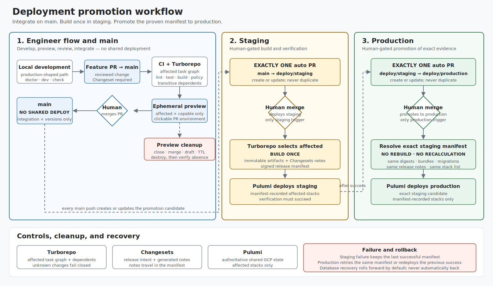

# Deployment promotion workflow

Use this page for a 5–10 minute team walkthrough of the proposed TECH-652 deployment path.

[Open the standalone SVG](deployment-workflow.svg)

**Suggested pace:** target outcome (1 minute), engineer flow (2), automation flow (3), invariants and example (2), discussion (remaining time).

## Target outcome

Give every engineer one predictable path from local development to production:

- Develop locally with production-shaped artifacts and configuration.
- Get a clickable, disposable preview for an ordinary pull request.
- Merge to `main` without deploying a shared environment.
- Promote to staging and production through explicit, human-merged pull requests.
- Build shared-environment artifacts once, then promote the exact proven staging manifest.

## Engineer flow

1. Run the relevant project locally from the monorepo using shared Dockerfiles, entrypoints, configuration contracts, migrations, and gateway aliases.
2. Open a PR to `main` with a Changeset or an approved empty-change exemption.
3. CI uses the Turborepo task graph to test and build affected work, including transitive dependents.
4. Preview automation creates a clickable environment for affected, preview-capable deployables.
5. Review and merge the PR. `main` integrates the change; **no shared environment deploys**.
6. Preview cleanup runs on merge, close, draft, or TTL expiry, then verifies the environment is absent.

## Automation flow

1. Every push to `main` creates or updates **exactly one** open PR from `main` to `deploy/staging`.
2. A human reviews and merges that PR. This merge is the only staging deploy trigger.
3. Turborepo selects affected deployables. They build once; automation publishes immutable artifacts, includes Changesets release notes, and writes a signed release manifest.
4. Pulumi deploys only the manifest-recorded staging stacks. Verification must succeed.
5. After staging succeeds, automation creates or updates **exactly one** open PR from `deploy/staging` to `deploy/production`.
6. A human reviews and merges that PR. Production resolves the successful staging manifest and Pulumi deploys its recorded production stacks—**no rebuild or affected recalculation**.

## Three invariants

1. **`main` integrates; it never deploys a shared environment.**
2. **Automation maintains exactly one promotion PR per hop; a human merge is the only shared-environment deploy trigger.**
3. **Production promotes the exact successful staging manifest; it never rebuilds the release candidate.**

## Worked example

A PR changes `packages/auth`, `services/api`, and includes one Changeset.

1. Turborepo selects `services/api` plus deployables transitively dependent on `packages/auth`.
2. Preview automation creates environments only for selected deployables that support previews.
3. The PR merges to `main`; the preview is destroyed and verified absent. No staging or production deployment occurs.
4. Changesets supplies canonical versions, changelogs, and release notes for the candidate.
5. The existing `main` → `deploy/staging` PR updates. A human merges it.
6. Staging builds the selected deployables once, publishes immutable artifacts, writes the manifest, and deploys affected Pulumi stacks.
7. After staging succeeds, the existing `deploy/staging` → `deploy/production` PR updates. A human merges it.
8. Production deploys the exact staging manifest. A transient failure retries that manifest; rollback redeploys the previous successful manifest without rebuilding. Database recovery rolls forward by default—there is no automatic database rollback.

## Discussion questions

- Do we agree that `main` never deploys a shared environment?
- Are human-merged, automation-maintained PRs the right gates for both promotion hops?
- Is the signed staging manifest sufficient as production's source of truth?
- Which deployable should prove the lifecycle first?
- Who owns Turborepo inputs, Changesets policy, Pulumi stacks, preview cleanup, and promotion approvals?

## References

- [Linear TECH-652](https://linear.app/foundai/issue/TECH-652/review-paved-path-deployments-and-define-unified-deployment)
- [Existing implementation PR: found-ai/monorepo#1](https://github.com/found-ai/monorepo/pull/1)
- [Target deployment workflow](deployment-workflow-target.md)
- [Standalone HTML/SVG workflow explainer](deployment-workflow-visual.html)
- [Deployment workflow visual guide](deployment-workflow-visual-guide.md)
