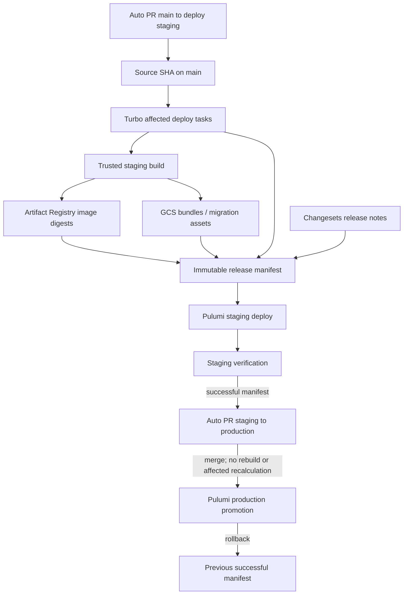

# Proposed target: monorepo development and deployment workflow

Date: 2026-07-22
Status: Proposed for team alignment
Linear: [TECH-652](https://linear.app/foundai/issue/TECH-652/review-paved-path-deployments-and-define-unified-deployment)
Visual guide: [Deployment workflow diagrams](deployment-workflow-visual-guide.md)
Polished explainer: [Standalone HTML/SVG workflow](deployment-workflow-visual.html)

## Objective

Give every engineer one clear workflow that:

- Starts the relevant platform locally with production-shaped artifacts and configuration.
- Creates a clickable ephemeral environment for ordinary pull requests.
- Lets changes merge to `main` without deploying a shared environment.
- Deploys staging only through an explicit staging-promotion pull request.
- Deploys production only by promoting an artifact set already proven in staging.
- Runs Pulumi only for deployables affected by the promoted changes.
- Requires Changesets and generates release notes automatically.

## Core principles

1. **One monorepo is the source of truth.** Applications, services, shared packages, infrastructure programs, migrations, fixtures, and deployment metadata live together.
2. **`main` never deploys shared environments.** It is the integration branch.
3. **Environment branches are promotion ledgers, not development branches.** They receive only controlled promotion pull requests.
4. **Preview, staging, and production are separate concerns.** Preview proves a PR; staging builds and validates a release candidate; production promotes that exact candidate.
5. **Build once for shared environments.** Production never rebuilds staging artifacts.
6. **The Turborepo package/task graph decides what is affected.** Raw file diffs are only inputs; transitive dependents, lockfile changes, migrations, and infrastructure relationships must be included.
7. **Pulumi remains authoritative for GCP state.** Other tools may improve developer experience but may not create a second ownership model.
8. **Every meaningful PR declares intent with a Changeset.** A documented empty changeset is the explicit exemption for changes that should not appear in release notes.

## Proposed monorepo shape

```text
/
├── apps/                  # frontends and user-facing applications
├── services/              # APIs, workers, gateway-adjacent services
├── packages/              # shared libraries and contracts
├── infrastructure/        # Pulumi projects/components and foundation contracts
├── migrations/            # versioned data migrations and fixtures
├── tooling/               # platform CLI, generators, policies, graph plugins
├── .changeset/            # release intent and human-readable summaries
├── turbo.json             # package/task graph, inputs, dependencies, and outputs
└── package.json           # root commands and workspace definition
```

Each deployable declares:

- Owners and source roots.
- Build, local-dev, test, and deploy targets.
- Runtime class: `gke`, `gce`, `cloud-run`, static bundle, or non-deployable package.
- Pulumi project/stack mapping.
- Dependencies on packages, infrastructure, migrations, data contracts, and gateway contracts.
- Whether it supports an ephemeral preview.

## Branch and event model

| Event | Required checks | Deployment behavior |
| --- | --- | --- |
| Feature PR → `main` | Changeset, Turbo affected task graph, lint/test/build, local parity checks, policy/security checks | Create/update previews for affected preview-capable deployables |
| Feature PR closes or merges | Teardown verification | Destroy preview; merging to `main` deploys no shared environment |
| Version/release PR → `main` | Changesets version/changelog validation | Updates canonical versions/changelogs only; still no shared deployment |
| Auto-maintained PR: `main` → `deploy/staging` | Affected plan, Changesets release notes, preview status, approval | On merge, build affected deployables once, publish immutable artifacts, write release manifest, deploy affected staging stacks |
| Auto-maintained PR: `deploy/staging` → `deploy/production` | Successful staging manifest, approval, rollback readiness | On merge, reuse exact staging artifacts and deploy the manifest's affected production stacks; no rebuild |

No direct commits are allowed on `deploy/staging` or `deploy/production`. They are protected environment branches updated only by approved promotion PR merges.

- Every push to `main` runs a promotion controller that ensures exactly one open PR from `main` to `deploy/staging`. If the PR already exists, GitHub automatically includes the new commits and the controller refreshes its title, affected-deployable plan, Changesets notes, and status. It never creates a duplicate PR.
- Merging that PR is the only event that deploys staging. A normal merge to `main` still deploys no shared environment.
- After the staging deployment succeeds, automation ensures exactly one open PR from `deploy/staging` to `deploy/production`. New successful staging commits update that same PR rather than creating another.
- Merging the production PR is the only event that deploys production. Production resolves the successful staging manifest for the promoted staging commit and reuses its exact artifacts without rebuilding or recalculating affected deployables.
- If source and target branches have no remaining diff, the corresponding promotion PR is closed. Workflows reject unrelated commits, bypass pushes, and a production source that lacks a successful staging manifest.

Unknown or unclassified changes fail closed.

## Target workflow diagram

```mermaid
flowchart LR
  F[Feature branch] --> P[PR to main]
  P --> C[CI + Changeset check]
  C --> A[Turbo affected task graph]
  A --> E[Ephemeral preview]
  E --> M[Merge to main]
  M --> N[Integration only\nNo shared deploy]

  N --> V[Changesets version/release PR]
  V --> R[Bot ensures PR main to deploy/staging]
  R --> RM[Human merges staging PR]
  RM --> B[Build affected deployables once]
  B --> I[Immutable artifacts + staging manifest]
  I --> S[Pulumi affected staging stacks]
  S --> G[Staging gates pass]
  G --> Q[Bot ensures PR staging to production]
  Q --> QM[Human merges production PR]
  QM --> X[Reuse exact staging manifest]
  X --> O[Pulumi affected production stacks]

  E -. close or merge .-> T[Destroy preview + verify absence]
```



### Linear-safe diagram

```text
feature branch
    │
    ▼
PR → main ── CI + Changeset + affected graph ──► ephemeral preview
    │                                                │
    └── merge ──► main (integration only)            └── close/merge → destroy
                       │
                       ▼
              version/release PR
                       │
                       ▼
        auto PR: main → deploy/staging
                       │ merge
                       ▼
       build affected once → immutable artifacts
                       │
                       ▼
          staging release manifest + deploy
                       │ approved manifest
                       ▼
      auto PR: deploy/staging → deploy/production
                       │ merge
                       ▼
       reuse exact artifacts → production deploy
```

## Artifact and promotion diagram



## Local development target

From the monorepo root, engineers should be able to run:

```text
platform doctor
platform dev <project-or-group>
platform check --affected
```

The local path must share production Dockerfiles, entrypoints, ports, typed configuration, service contracts, migrations, seeds, and gateway aliases. Local substitutes for IAM, VPC, TLS, managed databases, or GKE must be explicit and covered later by preview/staging tests.

### SST's proposed role

SST is a candidate developer-experience layer where `sst dev` and stage linking materially improve a deployable's local loop. On GCP:

- SST may use the GCP Pulumi provider for deployable-local resources.
- Pulumi projects/stacks remain the authoritative GCP ownership and promotion boundary.
- Turborepo—not SST—selects affected deployables.
- SST state/stages do not replace the release manifest, environment branches, or central lifecycle controller.
- Prefer one bounded SST app per deployable or coherent deployable group; SST deploy/remove is app/stage scoped rather than a monorepo-wide affected-project engine.
- Any SST use must remain removable: standard Dockerfiles, Pulumi provider code, typed contracts, and raw-tool escape hatches remain available.
- SST may not own shared staging/production GCP resources or promotion state. Cloud resources created through SST are limited to personal development or ephemeral preview scopes unless their provider code is promoted into the authoritative Pulumi project/stack model.

This keeps SST available for the local story without coupling company-wide promotion to its AWS/Cloudflare-oriented state and component model.

## Affected-deployable calculation

Use Turborepo as the monorepo package/task engine. Every deployable—including infrastructure and migration units—must be represented as a workspace package with a `deploy` task or an explicit dependency on one. A versioned deployable registry maps Turbo package/task IDs to Pulumi stacks, preview support, runtime class, artifact type, and ownership.

### Pull request previews

```text
base = merge-base(PR head, main)
head = tested PR merge SHA
affected = turbo query affected --tasks deploy --packages <deployable-scope> --base <base> --head <head>
```

Create previews only for affected deployables marked `preview: true`. Shared package, lockfile, migration, infrastructure, schema, or gateway changes expand to their transitive dependents.

Affected calculation always runs from the candidate workspace with explicit `base` and `head` or equivalent `TURBO_SCM_BASE` / `TURBO_SCM_HEAD` values. `turbo.json`, package configuration, lockfiles, package-manager configuration, infrastructure mappings, migration metadata, environment schemas, and gateway contracts are modeled through task `inputs`, `globalDependencies`, and package/task dependencies. Use `$TURBO_DEFAULT$` when narrowing inputs so ordinary tracked package files remain included.

Parse the task-level JSON result from `turbo query affected`; do not infer deployment selection only from cache hits or raw Git paths. Lockfile/global detection failures, missing history, bad refs, or an unclassified file conservatively select every deployable. CI uses a full-enough checkout for the base and head to exist.

### Staging promotion

```text
base = source SHA in last successful staging manifest
head = candidate source SHA from main
affected = turbo query affected --tasks deploy --packages <deployable-scope> --base <base> --head <head>
```

Build all affected deployables once. Pulumi runs only for their staging stacks plus explicitly modeled infrastructure dependents.

### Production promotion

Do not recalculate from branch diffs. The successful staging release manifest is the source of truth. Production deploys the exact `affectedDeployables`, artifacts, migration assets, and Pulumi stack list recorded there.

## Changesets and release notes

- Every meaningful PR to `main` includes a Changeset.
- True no-release work includes an explicit empty Changeset or approved exemption.
- The Changesets bot maintains a version/changelog PR against `main`.
- Before consuming Changesets, release automation writes a machine-readable release plan containing Changeset IDs, summaries, affected packages, and intended versions. The plan is committed or stored immutably, keyed by candidate source SHA, and referenced from the version PR.
- A release batch merges the version PR before staging promotion so the candidate SHA contains canonical versions, changelogs, and a durable release-plan reference even though consumed Changeset files are removed. Staging promotion fails if that exact plan cannot be resolved.
- Staging promotion copies that release plan and generated notes into the immutable release manifest.
- Production reuses those notes; it never regenerates them from a different branch state.

## Release manifest

Each successful staging promotion writes an immutable signed manifest similar to:

```json
{
  "releaseId": "2026-07-22T12-34-56Z-abcdef",
  "sourceSha": "abcdef",
  "affectedDeployables": ["web", "api"],
  "artifacts": {
    "web": { "bundleUri": "gs://...", "sha256": "..." },
    "api": { "imageDigest": "us-docker.pkg.dev/...@sha256:..." }
  },
  "pulumiStacks": {
    "staging": ["web-staging", "api-staging"],
    "production": ["web-production", "api-production"]
  },
  "changesets": ["green-llamas-jump"],
  "releaseNotesUri": "gs://.../release-notes.md",
  "createdByRun": "github-actions/12345",
  "status": "succeeded"
}
```

Production promotion references this manifest and records only production deployment results. Rollback redeploys the prior successful manifest without rebuilding.

## Ephemeral preview lifecycle

- Internal, non-draft PRs to `main` create previews automatically for affected preview-capable deployables.
- Preview names include PR number and generation; branch names are display metadata only.
- Preview artifacts are disposable builds from the tested PR SHA and never promoted directly to production.
- Preview uses the same build shape, config schema, migrations, service contracts, gateway path, and telemetry rules as staging.
- Close, merge, draft, TTL expiry, or failed admission triggers idempotent teardown and absence verification.
- Fork PRs receive cloudless checks unless reviewed code is imported into a trusted branch.

## Failure and rollback rules

- A failed preview cannot be marked Ready and is not shared.
- A staging failure does not advance the last successful staging manifest.
- A production failure never triggers a rebuild. Retry the same manifest for transient failures or roll back to the previous successful manifest.
- Partial environment deployment is failed unless every affected deployable succeeds or the manifest explicitly defines an approved atomicity boundary.
- Database changes must use forward-compatible expand/contract migrations unless an irreversible migration receives explicit approval and rollback planning.
- Manifest rollback redeploys application and infrastructure artifacts only. Database recovery is roll-forward by default; down migrations require explicit tested support, and irreversible migrations require approval before production promotion.
- One environment-specific concurrency group serializes promotions; preview mutations have their own bounded queue.

## Proposed technology responsibilities

| Concern | Proposed owner |
| --- | --- |
| Monorepo package/task graph | Turborepo |
| Release intent and notes | Changesets |
| Workflow and approvals | GitHub Actions + protected environments/branches |
| GCP desired state | Pulumi TypeScript |
| Optional local live development | SST where it provides measured value; otherwise Compose/native dev targets |
| Artifacts | Artifact Registry and GCS, addressed by immutable digest/hash |
| Promotion source of truth | Signed release manifest |
| Preview lifecycle | Trusted GCP-side controller/deployer and reconciler |

## Acceptance criteria for team alignment

- [ ] Engineers agree that `main` does not deploy shared environments.
- [ ] `deploy/staging` and `deploy/production` are promotion gates, not development branches.
- [ ] Production can only promote a successful staging manifest and never rebuilds.
- [ ] Turborepo is accepted as the affected-deployable source of truth, with task-level inputs and transitive dependents modeled explicitly.
- [ ] Changesets or explicit empty changesets are required on PRs to `main`.
- [ ] Ordinary internal PRs receive automatic previews for affected preview-capable deployables.
- [ ] Pulumi remains authoritative for GCP state.
- [ ] SST is accepted or rejected specifically as an optional local-DX layer, not assumed as the deployment control plane.
- [ ] The release manifest contract and rollback semantics are agreed.
- [ ] The first lifecycle proof and monorepo migration can be ticketed without unresolved workflow questions.

## Out of scope

- Migrating repositories into the monorepo.
- Implementing Turborepo, Changesets, SST, or environment workflows.
- Creating GCP preview resources.
- Selecting the first representative application for the lifecycle proof.

## Primary sources

- [SST basics and stages](https://github.com/anomalyco/sst/blob/a0bd20f762883e72a35caccb4896c42ce5b3f707/www/src/content/docs/docs/basics.mdx)
- [SST monorepo guidance](https://github.com/anomalyco/sst/blob/a0bd20f762883e72a35caccb4896c42ce5b3f707/www/src/content/docs/docs/set-up-a-monorepo.mdx)
- [SST provider model](https://github.com/anomalyco/sst/blob/a0bd20f762883e72a35caccb4896c42ce5b3f707/www/src/content/docs/docs/providers.mdx)
- [SST GCP provider listing](https://github.com/anomalyco/sst/blob/a0bd20f762883e72a35caccb4896c42ce5b3f707/www/src/content/docs/docs/all-providers.mdx)
- [Turborepo affected runs](https://turborepo.com/docs/reference/run#--affected)
- [Turborepo filtering and dependents](https://turborepo.com/docs/crafting-your-repository/running-tasks#using-filters)
- [Turborepo task dependencies and inputs](https://turborepo.com/docs/crafting-your-repository/configuring-tasks)
- [Turborepo task-level affected implementation](https://github.com/vercel/turborepo/blob/48d609c6ec22bbed5c80b48c92572adbdb48d57e/crates/turborepo-query/src/affected_tasks.rs)
- [Changesets configuration](https://github.com/changesets/changesets/blob/b5e1762584718ec607ea79db0a00ae4238f8a784/docs/config-file-options.md)
- [Changesets automation](https://github.com/changesets/changesets/blob/b5e1762584718ec607ea79db0a00ae4238f8a784/docs/automating-changesets.md)
- [Changesets GitHub Action](https://github.com/changesets/action/blob/84d78c68f98f20e24dfff22b22193e7b4f326ad9/README.md)
- [GitHub Actions workflow syntax](https://github.com/github/docs/blob/main/content/actions/reference/workflows-and-actions/workflow-syntax.md)
- [GitHub Actions concurrency](https://github.com/github/docs/blob/main/content/actions/how-tos/write-workflows/choose-when-workflows-run/control-workflow-concurrency.md)
- [GitHub deployment environments](https://github.com/github/docs/blob/main/content/actions/how-tos/deploy/configure-and-manage-deployments/manage-environments.md)
