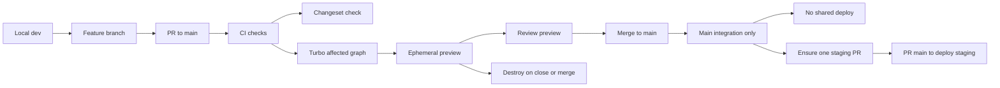
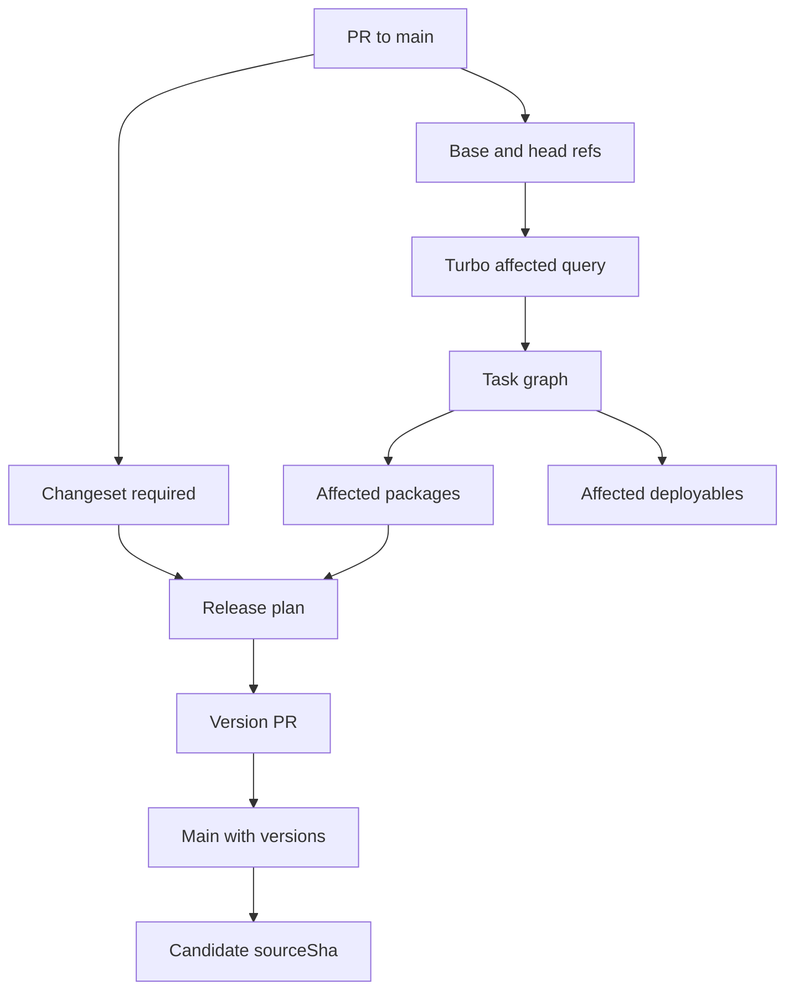
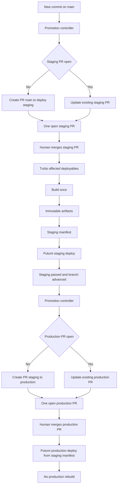
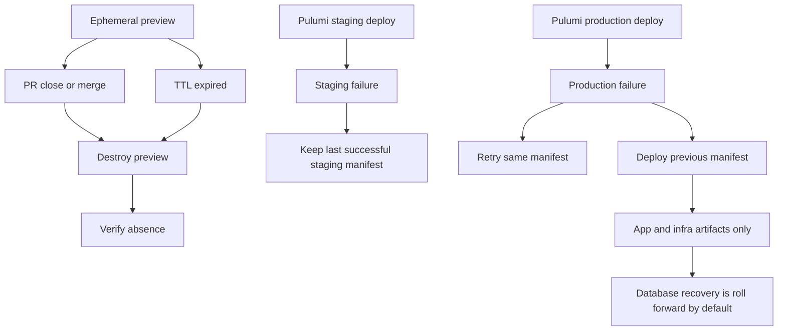

# Deployment Workflow Visual Guide

Date: 2026-07-22
Status: Proposed TECH-652 alignment artifact
Source: [Target deployment workflow](deployment-workflow-target.md)
Polished explainer: [Standalone HTML/SVG workflow](deployment-workflow-visual.html)
Linear: [TECH-652](https://linear.app/foundai/issue/TECH-652/review-paved-path-deployments-and-define-unified-deployment)

## ASCII Overview

```text
local dev
   |
   v
feature branch
   |
   v
PR to main
   |
   +--> CI checks
   |       |
   |       +--> Changeset required
   |       +--> Turborepo affected graph
   |       +--> preview for affected deployables
   |
   v
merge to main
   |
   v
main integration only
   |
   v
version and release plan
   |
   v
automatic PR: main to deploy/staging
   |
   v
checkout sourceSha from main
   |
   v
build affected deployables once
   |
   v
immutable artifacts and staging manifest
   |
   v
Pulumi staging deploy
   |
   v
automatic PR: deploy/staging to deploy/production
   |
   v
reuse staging manifest and artifacts
   |
   v
Pulumi production deploy
```

## Legend

| Symbol or term | Meaning |
| --- | --- |
| `main` | Integration branch only. It does not deploy shared environments. |
| `deploy/staging` | Protected staging branch. Automation keeps one PR open from `main`; merging it deploys staging. |
| `deploy/production` | Protected production branch. Automation keeps one PR open from staging; merging it deploys production. |
| `sourceSha` | Commit on `main` that staging checks out, builds, and records in the manifest. |
| Manifest | Immutable record of source SHA, affected deployables, artifacts, release notes, and Pulumi stacks. |
| Pulumi | Authoritative owner of GCP desired state. |
| Turborepo | Source of truth for affected package and deploy-task selection. |
| Changesets | Required release intent and release-note source. |

## Branch and Environment Matrix

| Branch or event | Purpose | Shared deploy? | Artifact behavior |
| --- | --- | --- | --- |
| Local workspace | Engineer development loop | No | Local production-shaped build and config |
| Feature branch | Development source | No | Disposable local or CI build only |
| PR to `main` | Review and validation | Preview only | Build affected preview-capable deployables |
| `main` merge | Integration | No | No staging or production deploy |
| Version PR to `main` | Canonical versions and changelogs | No | Release plan becomes tied to candidate source |
| Auto PR: `main` → `deploy/staging` | Staging promotion gate; updated whenever `main` advances | Staging only, on merge | Build affected deployables once and write manifest |
| Auto PR: `deploy/staging` → `deploy/production` | Production promotion gate; updated after successful staging merges | Production only, on merge | Reuse successful staging manifest and artifacts; no rebuild |

## Diagram 1: Local to PR Preview to Main No Deploy



## Diagram 2: Turborepo Affected and Changesets Release Plan



## Diagram 3: Automatic Promotion PRs



## Diagram 4: Preview Cleanup and Failure Rollback



## Glossary

| Term | Definition |
| --- | --- |
| Affected deployable | A deployable selected by the Turborepo task graph because its source, dependency, infrastructure, migration, lockfile, schema, or contract inputs changed. |
| Environment branch | A protected source snapshot for an environment, updated only by merging its single automation-maintained promotion PR. |
| Release manifest | Immutable signed output from successful staging containing source SHA, affected deployables, artifact digests, release notes, and Pulumi stack lists. |
| Promotion | Controlled movement of a proven source and artifact set into staging or production through an environment-branch PR. |
| Roll forward | Database recovery strategy where a later migration or fix advances state safely instead of assuming automatic down-migration rollback. |

## Worked Example

A PR changes `packages/auth`, `services/api`, and a Changeset.

1. The PR targets `main`.
2. CI requires the Changeset and runs the Turborepo affected query.
3. Turborepo selects `services/api` and any transitive deployables that depend on `packages/auth`.
4. Preview automation creates previews only for affected deployables marked preview-capable.
5. After review, the PR merges to `main`.
6. `main` does not deploy staging or production.
7. The Changesets version PR updates versions, changelogs, and the release plan on `main`.
8. The promotion controller creates or updates the one open PR from `main` to `deploy/staging` as `main` advances.
9. On merge, staging automation computes affected deployables, builds them once, publishes immutable artifacts, writes the release manifest, and runs Pulumi for affected staging stacks.
10. After staging succeeds, the controller creates or updates the one open PR from `deploy/staging` to `deploy/production`.
11. Production reuses the exact manifest and artifacts. It does not rebuild or recalculate affected deployables from branch diffs.
12. If production fails, automation retries the same manifest for transient issues or redeploys the previous successful manifest. Database recovery is roll-forward by default unless tested down migrations were explicitly approved.

## Other Ways to Teach the Process

- **Five-minute narrated walkthrough:** Use Diagram 1 to explain the engineer experience, then Diagram 3 to explain release control.
- **Worked promotion PR:** Include the source/target branch diff, affected-task output, release manifest, and generated release notes.
- **Branch protection checklist:** Document who may open and approve promotion PRs and which checks block merges.
- **Command cheat sheet:** Show the local commands, preview URL/status commands, staging promotion command, and rollback command.
- **Failure game day:** Rehearse preview cleanup, staging failure, and production manifest rollback without changing database state backward.
- **Ownership table:** Name the team responsible for Turborepo config, Changesets policy, Pulumi stacks, preview lifecycle, and production approvals.
